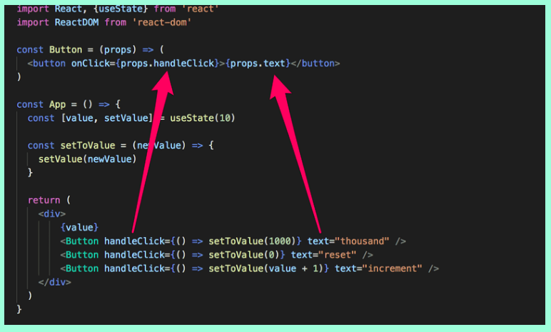

# Introduction to React
## Component
        Components let you split the UI into independent, reusable pieces, and think about each piece in isolation. Conceptually, components are like JavaScript functions. They accept arbitrary inputs (called “props”) and return React elements describing what should appear on the screen.
 * The file public/index.html doesn't contain any HTML markup that is visible to us in the browser. You can try adding some HTML into the file. However, when using React, all content that needs to be rendered is usually defined as React components.       

        const App = () => (
        

        
Hello world

        

        )
        A component example.

* There are a few ways to define functions in JavaScript. Here we will use arrow functions : https://developer.mozilla.org/en-US/docs/Web/JavaScript/Reference/Functions/Arrow_functions

* Podes modificar el App.js para ver como se va modificando lo que se ve en pantalla 

## JSX
* It seems like React components are returning HTML markup. However, this is not the case. The layout of React components is mostly written using JSX. Although JSX looks like HTML, we are actually dealing with a way to write JavaScript. Under the hood, JSX returned by React components is compiled into JavaScript.

        JSX  is a syntax extension to JavaScript. We recommend using it with React to describe what the UI should look like. JSX may remind you of a template language, but it comes with the full power of JavaScript.

* It is also possible to write React as "pure JavaScript" without using JSX. Although, nobody with a sound mind would actually do so.        

* In practice, JSX is much like HTML with the distinction that with JSX you can easily embed dynamic content by writing appropriate JavaScript within curly braces.

## Multiple components

* We can define component and use them inside other components
* Writing components with React is easy, and by combining components, even a more complex application can be kept fairly maintainable. Indeed, a core philosophy of React is composing applications from many specialized reusable components.

* Another strong convention is the idea of a root component called App at the top of the component tree of the application. Nevertheless, as we will learn in part 6, there are situations where the component App is not exactly the root, but is wrapped within an appropriate utility component.

## props: passing data to components

* It is possible to pass data to components using so called props.

        const Hello = (props) => {
        return (
        

        

                Hello {props.name}, you are {props.age} 
        

        

        )
        }

        const App = () => {
        const name = 'Peter'
        const age = 10

        return (
        

          <h1>Greetings</h1>
            <Hello name="Maya" age={26 + 10} />
            <Hello name={name} age={age} />
        

        )
        }

## Some notes: 
* It is good to remember that in React it is possible and worthwhile to write console.log() commands (which print to the console) within your code.

* React component names must be capitalized        

# JavaScript
*  The official name of the JavaScript standard is ECMAScript

        ECMAScript is a general-purpose programming language, standardised by Ecma International according to the document ECMA-262. It is a JavaScript standard meant to ensure the interoperability of Web pages across different Web browsers.[2] ECMAScript is commonly used for client-side scripting on the World Wide Web, and it is increasingly being used for writing server applications and services using Node.js.
        
* Browsers do not yet support all of JavaScript's newest features. Due to this fact, a lot of code run in browsers has been transpiled from a newer version of JavaScript to an older, more compatible version. The most popular way to do the transpiling is by using Babel.    

* Node.js is a JavaScript runtime environment based on Google's Chrome V8 JavaScript engine and works practically anywhere - from servers to mobile phones.
* It is also possible to write JavaScript code into the Node.js console, which is opened by typing node in the command-line, as well as into the browser's developer tool console.

## Variables

        const x = 1
        let y = 5

        console.log(x, y)   // 1, 5 are printed
        y += 10
        console.log(x, y)   // 1, 15 are printed
        y = 'sometext'
        console.log(x, y)   // 1, sometext are printed
        x = 4               // causes an error

* It is also possible to define variables in JavaScript using the keyword var.

        var scope: TODA la function        
        let scope: bounded by the curly braces {}

## Arrays 
        const t = [1, -1, 3]

        t.push(5)

        console.log(t.length) // 4 is printed
        console.log(t[1])     // -1 is printed

        t.forEach(value => {
        console.log(value)  // numbers 1, -1, 3, 5 are printed, each to own line
        })                            

* Notable in this example is the fact that the contents of the array can be modified even though it is defined as a const

* One way of iterating through the items of the array is using forEach as seen in the example.        

### Examples of functions of arrays
* Push:  method adds one or more elements to the end of an array and returns the new length of the array.
* Concat: does not add the item to the array, but creates a new array in which the content of the old array and the new item are both included.

* Map: Based on the old array, map creates a new array, for which the function given as a parameter is used to create the items. 

        const t = [1, 2, 3]

        const m1 = t.map(value => value * 2)
        console.log(m1)   // [2, 4, 6] is printed

        const m2 = t.map(value => '<li>' + value + '</li>')
        console.log(m2)  
        // [ '<li>1</li>', '<li>2</li>', '<li>3</li>' ] is printed

* Destructuring assignment : The destructuring assignment syntax is a JavaScript expression that makes it possible to unpack values from arrays, or properties from objects, into distinct variables.       

        const t = [1, 2, 3, 4, 5]
        const [first, second, ...rest] = t
        console.log(first, second)  // 1, 2 is printed
        console.log(rest)          // [3, 4 ,5] is printed

## Objects        
* There are a few different ways of defining objects in JavaScript. One very common method is using object literals, which happens by listing its properties within braces:

        const object1 = {
        name: 'Arto Hellas',
        age: 35,
        education: 'PhD',
        }

        var car = { myCar: 'Saturn', getCar: carTypes('Honda'), special: sales };
        // Where carTypes(variable) is a function.

*  You can also add properties to an object on the fly by either using dot notation or brackets:       

        object1.address = 'Helsinki'
        object1['secret number'] = 12341

* You create an object method with the following syntax:

        methodName : function() { code lines }

## Object methods and "this":

* We can assign methods to an object by defining properties that are functions:

        const arto = {
        name: 'Arto Hellas',
        age: 35,
        education: 'PhD',
        greet: function() {
        console.log('hello, my name is ' + this.name)
        },
        }

        arto.greet()  // "hello, my name is Arto Hellas" gets printed

* Methods can be assigned to objects even after the creation of the object:        

        arto.growOlder = function() {
        this.age += 1
        }

* You can store a method reference in a variable.        

        const referenceToGreet = arto.greet
        referenceToGreet() // prints "hello, my name is undefined"

## Classes:

* As mentioned previously, there is no class mechanism like the ones in object-oriented programming languages. There are, however, features in JavaScript which make "simulating" object-oriented classes possible.

        class Person {
        constructor(name, age) {
        this.name = name
        this.age = age
        }
        greet() {
        console.log('hello, my name is ' + this.name)
        }
        }

        const adam = new Person('Adam Ondra', 35)
        adam.greet()

        const janja = new Person('Janja Garnbret', 22)
        janja.greet()

* JavaScript essentially only defines the types Boolean, Null, Undefined, Number, String, Symbol, BigInt, and Object.        

# Component state, event handlers:

## Destructuring:
        The destructuring assignment syntax is a JavaScript expression that makes it possible to unpack values from arrays, or properties from objects, into distinct variables.

*  El chabon lo usa para hacer mas sencillo el pasaje de parametros

        const Hello = (props) => {
        const name = props.name           = Aca hace destructuring
        const age = props.age             =

        const bornYear = () => new Date().getFullYear() - age

        return (
        

        
Hello {name}, you are {age} years old

        
So you were probably born in {bornYear()}

        

        )
        }

* Tambien se puede hacer con esta notacion:
       
       
        const Hello = (props) => {
                const { name, age } = props 
        }       

* Aunque se puede llevar a un paso mas.

        const Hello = ({ name, age }) => {

## Page re-rendering:

So far all of our applications have been such that their appearance remains the same after the initial rendering. What if we wanted to create a counter where the value increased as a function of time or at the click of a button?

* We can get the component to re-render by calling the ReactDOM.render method

* El metodo setInterval() repeatedly calls a function or executes a code snippet, with a fixed time delay between each call. 
       
     * sin embargo, no se recomienda usar esta forma para actualizar paginas.

## Stateful component

All of our components up till now have been simple in the sense that they have not contained any state that could change during the lifecycle of the component.

* Para hacerlo mas dinamico vamos a usar el state hook de React.

        What is a Hook? A Hook is a special function that lets you “hook into” React features. For example, useState is a Hook that lets you add React state to function components. 

 * Puedo usar el useState para representar estados

        function Example() {
           const [count, setCount] = useState(0);

        De ahora en mas, se puede usar count para saber el valor y setCount para setearlo.   

* Lo groso de esto es que puede hacerse dentro de una funcion y no se necesita que tengas una clase, que sin los useState seria necesario.        

        const App = () => {
        const [ counter, setCounter ] = useState(0)

        setTimeout(
        () => setCounter(counter + 1),
        1000
        )

        Cuando se llama a SetTimeOut y se ejecuta el setCounter, eso por como funciona el useState hace que vuelva a ser llamado toda la funcion App(), pero no se pierde el estado. En ese caso counter va a valer 1. 

## Event handling:        

Podemos crear paginas mas dinamicas usando event handlers que son llamados cada vez que se activa un trigger. Este codigo muestra un ejemplo para un click con el mouse.

                        const App = () => {
                const [ counter, setCounter ] = useState(0)

                const handleClick = () => {
                console.log('clicked')
                }

                return (
                

                
{counter}

                <button onClick={handleClick}>
                        plus
                </button>
                

                )
                }

* The event handler function can also be defined directly in the value assignment of the onClick-attribute:
             
              <button onClick={() => console.log('clicked')}>

## Event handler is a function
* An event handler is supposed to be either a function or a function reference,

* Si ponemos una llamada a una funcion, esta es llamada al cargar el componente y para no hacer un loop infinito de cargar React no te deja hacer esto.

        <button onClick={setCounter(counter + 1)}>

# A more complex state, debugging React apps

## Complex state

* The component's state or a piece of its state can be of any type.

        const App = () => {
        const [clicks, setClicks] = useState({
        left: 0, right: 0
        })

* **Object spread** ejemplos:

        function myFunction(x, y, z) { }
        let args = [0, 1, 2];
        myFunction(...args);

        Te convierte el array de forma tal que pueda usarse en una funcion que los parametros se pasan por separado.

        let arr1 = [0, 1, 2];
        let arr2 = [3, 4, 5];

        arr1 = [...arr1, ...arr2];

        //  arr1 is now [0, 1, 2, 3, 4, 5]
        // Note: Not to use const otherwise, it will give TypeError (invalid assignment)

* it is forbidden in React to mutate state directly, since it can result in unexpected side effects. Changing state has to always be done by setting the state to a new object. If properties from the previous state object are not changed, they need to simply be copied, which is done by copying those properties into a new object, and setting that as the new state.        

        const handleLeftClick = () => {
        clicks.left++
        setClicks(clicks)
        }

        // Esto es lo que esta mal.
        Tendrias que crear un objeto nuevo y de ahi llamar a setClicks con el objeto nuevo.

## Contidional rendering
* Quiere decir que lo que se renderiza depende de una condicion. Por ejemplo:

        const History = (props) => {
                if (props.allClicks.length === 0) {
                return (
                

                        the app is used by pressing the buttons
                

                )
                }
                return (
                

                button press history: {props.allClicks.join(' ')}
                

                )
                }

* In this course we use the state hook to add state to our React components, which is part of the newer versions of React and is available from version 16.8.0 onwards. Before the addition of hooks, there was no way to add state to functional components. Components that required state had to be defined as class components, using the JavaScript class syntax.

## Debugging React applications
* usando la instruccion **debugger** se para la ejecucion donde la estes usando. Esto es muy practico.                           
* El curso recomienda siempre tener abierto el codigo Y la aplicacion al mismo tiempo.
* Tambien podes poner breakpoints desde la consola de web.

## Rules of Hooks

The useState function (as well as the useEffect function introduced later on in the course) must not be called from inside of a loop, a conditional expression, or any place that is not a function defining a component. This must be done to ensure that the hooks are always called in the same order, and if this isn't the case the application will behave erratically.

To recap, hooks may only be called from the inside of a function body that defines a React component:

## Function that returns a function

        const hello = () => {
                const handler = () => console.log('hello world')

                return handler
        }

## Passing Event Handlers to Child Components

## Do Not Define Components Within Components
Lo que dice el titulo..